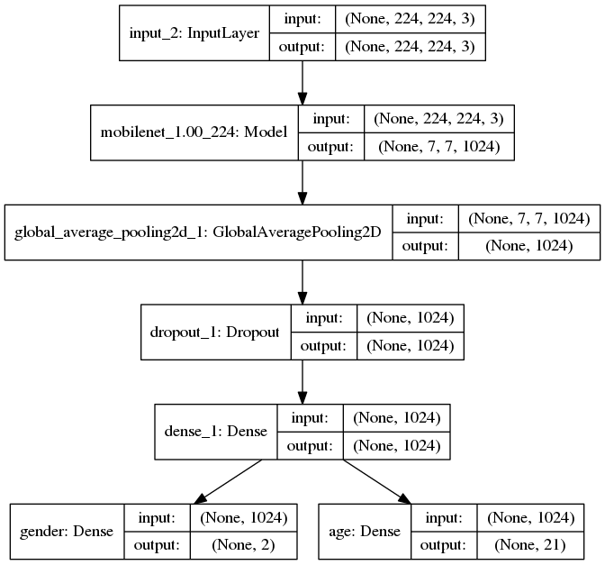
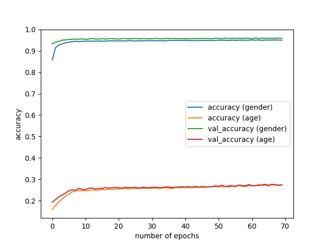
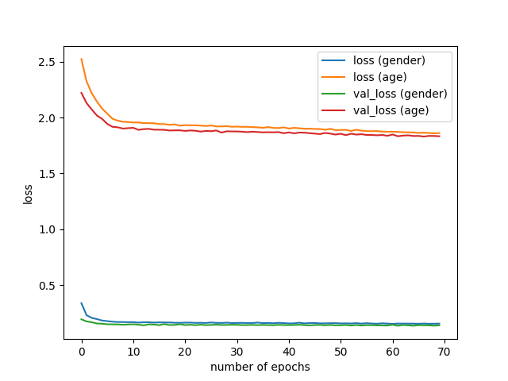

# Estimating Age and Gender using MobileNets

Read the blog [here](https://medium.com/ymedialabs-innovation/estimating-age-and-gender-with-mobilenets-13eaee1e819c)

## Prerequisites
- Python 3.5+
- Keras 2.0+
- scipy, numpy, Pandas, tqdm, tables, h5py
- dlib (for demo)
- OpenCV3

It has been tested on a machine running Ubuntu 16.04 with Python 3.5.2, Keras 2.1.2, TensorFlow(-gpu) 1.5.0, CUDA 9.0, cuDNN 7.0.


## Usage

### Download the IMDB dataset
Run the bash script. This will download and extract the dataset.


```sh
bash download.sh
```

### Train the model

Run train.py 
```sh
python3 train.py --input data/imdb.mat
```

The trained models are stored in the directory `checkpoints` as `weights.{epoch}-{val_loss}.hdf5` for each epoch if the validation improves over time.   


```sh
usage: train.py [-h] --input INPUT [--batch_size BATCH_SIZE]
                [--nb_epochs NB_EPOCHS] [--validation_split VALIDATION_SPLIT]    
```                           
### Plot training curves

```sh
python3 plot_history.py --input models/history.h5 
```

## Model architecture


## Results
After training the model for 70 epochs, the following results were obtained. 





## License
This project is released under the MIT license.
[the IMDB-WIKI dataset] being used is subject to the following conditions.

> Please notice that this dataset is made available for academic research purpose only. All the images are collected from the Internet, and the copyright belongs to the original owners. If any of the images belongs to you and you would like it removed, please kindly inform us, we will remove it from our dataset immediately.


## References
[1] R. Rothe, R. Timofte, and L. V. Gool, "DEX: Deep EXpectation of apparent age from a single image," ICCV, 2015.

[2] R. Rothe, R. Timofte, and L. V. Gool, "Deep expectation of real and apparent age from a single image
without facial landmarks," IJCV, 2016.
